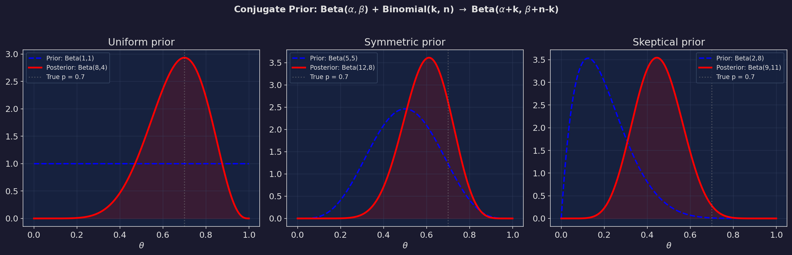

# 機率教室 第二篇：雜訊 — 分布家族與共軛更新

> 對應小說第 13-24 章。這一篇教你認識四大分布家族、理解共軛先驗的數學魔術，以及聯合分布與邊際分布的維度壓縮。

---

## 1. 四大分布家族

**小說出處**：第14章（分布的味道）

馬可瑜用味覺比喻分布——「每種分布都有自己的味道」。

### 常態分布 (Normal / Gaussian)

$$f(x) = \frac{1}{\sigma\sqrt{2\pi}} \exp\left(-\frac{(x-\mu)^2}{2\sigma^2}\right)$$

| 參數 | 意義 | 效果 |
|------|------|------|
| μ | 中心位置 | 分布左右平移 |
| σ | 散佈程度 | σ 越大，分布越胖 |

**特性**：
- 完美對稱（第55章柏朗：「高斯分布的對稱性」）
- 68.3% 的數據在 μ ± 1σ 內
- 95.4% 在 μ ± 2σ 內
- 99.7% 在 μ ± 3σ 內

### 指數分布 (Exponential)

$$f(x) = \lambda e^{-\lambda x}, \quad x \geq 0$$

| 參數 | 意義 | 小說數值 |
|------|------|----------|
| λ | 事件發生率 | 0.58 (Ch.53) |
| 1/λ | 平均等待時間 | 1.72 小時 |

**核心特性——無記憶性**（第53章）：

$$P(T > t + s \mid T > t) = P(T > s)$$

> 「你已經等了兩小時還沒有意外發生——下一個意外的等待時間分布跟你剛開始等的時候完全一樣。過去不影響未來。」

### Gamma 分布

$$f(x) = \frac{\beta^\alpha}{\Gamma(\alpha)} x^{\alpha-1} e^{-\beta x}, \quad x \geq 0$$

| 參數 | 意義 | 原始 (Ch.30) | 修改後 (Ch.33) |
|------|------|--------------|----------------|
| α | 形狀 | 3.2 | 1.8 |
| β | 速率 | 1.1 | 1.4 |
| E[X] = α/β | 期望值 | 2.91 | 1.29 |
| σ = √α/β | 標準差 | 1.63 | 0.96 |

**小說關鍵**：統計蜜罐用的就是 Gamma 分布。原始 Gamma(3.2, 1.1) 被修改成 Gamma(1.8, 1.4)，期望值從 2.91 跳到 1.29，偏移量 = 1.62，超過 5σ 門檻。

### Beta 分布

（詳見第一篇）

$$f(\theta) = \frac{\theta^{\alpha-1}(1-\theta)^{\beta-1}}{B(\alpha, \beta)}, \quad 0 \leq \theta \leq 1$$

> 「每種分布都有自己的味道。常態分布像白開水——乾淨、對稱、到處都是。指數分布像黑咖啡——一開始很苦，然後漸漸沒味道。Gamma 像老薑茶——暖的，有尾巴。Beta 像酸梅湯——被限制在一個杯子裡，但那個杯子裡什麼味道都有。」——第十四章，馬可瑜


---

## 2. 共軛先驗 — 完美犯罪的數學

**小說出處**：第16章（共軛先驗）

### 什麼是共軛？

如果先驗和後驗屬於同一個分布家族，就稱這對先驗-似然是**共軛的**。

| 似然函數 | 共軛先驗 | 後驗 |
|----------|----------|------|
| Bernoulli / Binomial | Beta(α, β) | Beta(α+k, β+n-k) |
| Poisson | Gamma(α, β) | Gamma(α+Σx, β+n) |
| Normal (已知 σ²) | Normal(μ₀, σ₀²) | Normal(μ_n, σ_n²) |
| Exponential | Gamma(α, β) | Gamma(α+n, β+Σx) |

### 為什麼共軛先驗是「完美犯罪」？

第16章解釋：如果有人偷偷把你的先驗從 Beta(5, 5) 改成 Beta(3, 7)——

```
你看到的還是 Beta 分布。形狀變了，但「類型」沒變。
就像有人偷偷把你的眼鏡度數改了——
你看到的世界還是清楚的（Beta 分布的樣子），
只是偏了。你不會注意到。

因為後驗 = Beta(α+k, β+n-k)——
不管先驗的 α, β 被改成什麼，
後驗的「形式」都一樣。
只是數值不同。

這就是 Oracular 的手法。
```

### 數值範例：偷改先驗

```
正常先驗：Beta(5, 5), E = 0.50
被改先驗：Beta(3, 7), E = 0.30（往「危險」方向偏移）

觀測到 8 次安全、2 次危險（n=10, k=8）：

正常後驗：Beta(5+8, 5+2) = Beta(13, 7), E = 0.65
被改後驗：Beta(3+8, 7+2) = Beta(11, 9), E = 0.55

差距：0.65 vs 0.55 = 偏移了 0.10

使用者看到的機率從 65% 變成 55%——
覺得世界比實際更危險。
但他不知道。因為一切看起來都很「正常」。
```

> 「共軛先驗。同族更新。修改前是 Beta。修改後還是 Beta。像在你的眼鏡上加了一層膜——你還是看得見。只是顏色偏了。你不會知道。」——第十六章



---

## 3. 聯合分布與邊際分布

**小說出處**：第22章（聯合與邊際）

### 定義

兩個隨機變數 X, Y 的**聯合分布**：

$$f(x, y) = \text{X 和 Y 同時取某個值的機率密度}$$

**邊際分布**——把另一個變數「積分掉」：

$$f_X(x) = \int_{-\infty}^{\infty} f(x, y) \, dy$$

$$f_Y(y) = \int_{-\infty}^{\infty} f(x, y) \, dx$$

### 小說怎麼用的

第22章把先驗修改事件放在二維空間裡分析：

```
X 軸：修改幅度（0% 到 100%）
Y 軸：修改時間戳

聯合分布 f(x, y)：
  → 看出修改幅度和時間之間有相關性
  → 大幅度修改集中在特定時段（凌晨 2-4 點）

邊際分布 f_X(x)：
  → 把時間積分掉 → 只看「修改幅度的分布」
  → 發現高修改幅度區域集中在 α > 0.5

邊際分布 f_Y(y)：
  → 把幅度積分掉 → 只看「時間的分布」
  → 發現三個峰值：8月、11月、2月（每三個月一次）
```

### 條件分布

$$f_{Y|X}(y | x) = \frac{f(x, y)}{f_X(x)}$$

> 「知道修改幅度大於 50% 的情況下，時間的分布是什麼？」→ 集中在凌晨。

> 「兩個維度的數據像一片星空。你可以把它壓成一條線——邊際分布。但壓的時候你會失去一些東西。你會失去星星之間的距離。」——第二十二章


---

## 4. 核密度估計 (KDE)

**小說出處**：第23章（時間窗口）

### 什麼是 KDE？

當你有一堆數據點，想估計它背後的連續分布形狀：

$$\hat{f}(x) = \frac{1}{nh} \sum_{i=1}^{n} K\left(\frac{x - x_i}{h}\right)$$

- $K$：核函數（通常用高斯核）
- $h$：帶寬（控制平滑程度）
- $x_i$：每個數據點

### 直覺

把每個數據點想像成一個小「丘」（高斯形狀），然後把所有的丘加起來，就得到整體的密度估計。

### 小說中的應用

```
40 個數據點（23 個犯罪樣本 + 17 個保險樣本）
三個時間峰值：2044年8月、11月、2045年2月
間隔：每 3 個月一次

KDE 的三峰結構 → 修改是週期性的
預測：下一次修改在 2045年5月

凌晨 02:00-04:00 的時間窗口 → 修改者的行為模式
```

---

## 5. 中央極限定理 (CLT) — 預覽

**小說出處**：第14章提及、第28章完整展開

雖然 CLT 的完整教學在第三篇，但第14章已經透露了核心概念：

$$\frac{\bar{X}_n - \mu}{\sigma / \sqrt{n}} \xrightarrow{d} N(0, 1)$$

> 不管原始分布長什麼樣——指數的、Gamma 的、Beta 的——只要 n 夠大，樣本平均值就會趨近常態分布。

這就是常態分布「統治一切」的原因。它不是因為世界是常態的，而是因為**平均**是常態的。

> 「不管原始分布長什麼樣——夠多人的平均，永遠趨向常態。這就是為什麼全世界這麼不一樣的人，考試成績的分布永遠是鐘形的。」——第二十八章，高思遠


---

## 練習題

**題目 1**：假設犯罪事件服從 Poisson(λ)，你的先驗是 Gamma(2, 1)。觀測到 5 天內共 8 起事件。求後驗分布和 λ 的後驗期望值。

<details>
<summary>解答</summary>

```
Poisson 的共軛先驗是 Gamma。

先驗：Gamma(α₀=2, β₀=1)
數據：n=5 天, Σx=8 起事件

後驗：Gamma(α₀ + Σx, β₀ + n)
     = Gamma(2 + 8, 1 + 5)
     = Gamma(10, 6)

後驗期望值 = α/β = 10/6 ≈ 1.67 事件/天

（跟 MLE = 8/5 = 1.6 很接近，因為先驗不是太強）
```
</details>

**題目 2**：你有聯合分布 f(x, y) = 6xy，定義在 0 < x < 1, 0 < y < 1。求 (a) f_X(x) (b) P(X > 0.5)

<details>
<summary>解答</summary>

```
(a) f_X(x) = ∫₀¹ 6xy dy = 6x · [y²/2]₀¹ = 6x · 1/2 = 3x

(b) P(X > 0.5) = ∫₀.₅¹ 3x dx = 3 · [x²/2]₀.₅¹ = 3 · (1/2 - 1/8) = 3 · 3/8 = 9/8

等等——機率不能超過 1！讓我重新算...

P(X > 0.5) = ∫₀.₅¹ 3x dx = 3[x²/2]₀.₅¹ = 3(0.5 - 0.125) = 3 × 0.375 = 1.125

還是大於 1？讓我檢查 f(x,y) 是否是有效的密度函數...

∫₀¹∫₀¹ 6xy dx dy = 6 · [x²/2]₀¹ · [y²/2]₀¹ = 6 · 0.5 · 0.5 = 1.5 ≠ 1

原來 f(x,y) = 6xy 不是在 [0,1]² 上的有效密度！

修正：f(x,y) = 6xy 的有效定義域是 x + y ≤ 1 的三角形區域。

在這個定義域下：
f_X(x) = ∫₀^(1-x) 6xy dy = 6x · [(1-x)²/2] = 3x(1-x)²

P(X > 0.5) = ∫₀.₅¹ 3x(1-x)² dx
           = 3∫₀.₅¹ (x - 2x² + x³) dx
           = 3[x²/2 - 2x³/3 + x⁴/4]₀.₅¹
           = 3[(1/2 - 2/3 + 1/4) - (1/8 - 1/12 + 1/64)]
           = 3[(6/12 - 8/12 + 3/12) - (8/64 - 16/192 + 3/192)]
           = 3[1/12 - 0.0573...]
           ≈ 0.078

只有 7.8% 的機率 X > 0.5 ——
因為在三角形區域裡，x 大的時候 y 的空間很小。
```

這題的重點：**定義域很重要！** 聯合分布的定義域決定了邊際分布的形狀。
</details>
