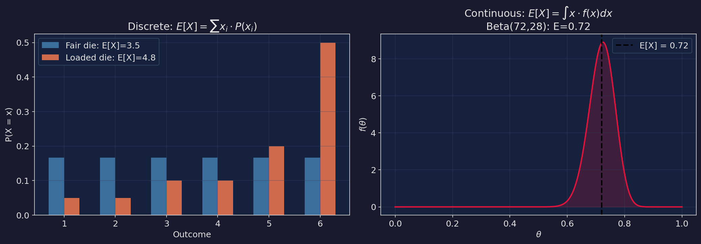
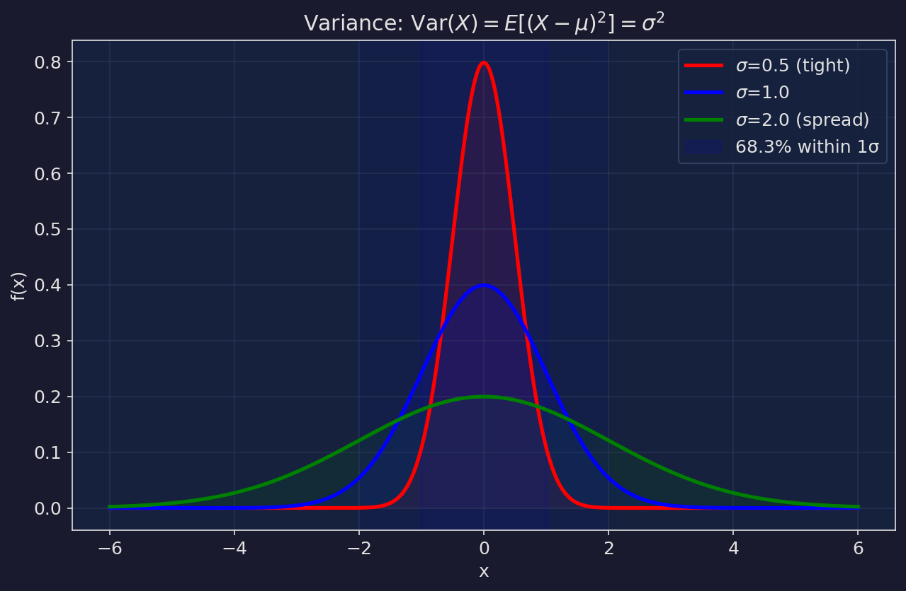
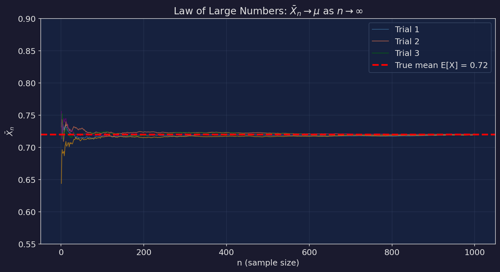
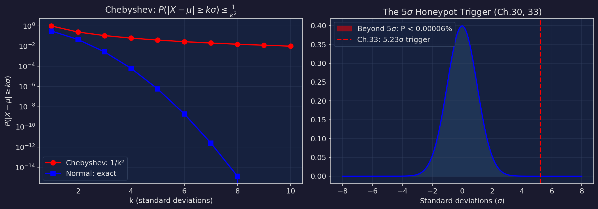
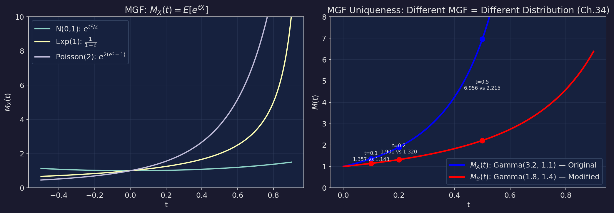

# 機率教室 第三篇：信號 — 期望值、變異數、不等式、MGF

> 對應小說第 25-36 章。這一篇從期望值開始，一路推到 Chebyshev 不等式和動差生成函數。如果說前兩篇是認識工具，這一篇是學會用工具抓壞人。

---

## 1. 期望值 — 平均的真正意義

**小說出處**：第25章（蔥油餅會議）、第26章（期望值與代價）

### 離散型

$$E[X] = \sum_{i} x_i \cdot P(X = x_i)$$

### 連續型

$$E[X] = \int_{-\infty}^{\infty} x \cdot f(x) \, dx$$

### 期望值的線性性（最重要的性質）

不管 X 和 Y 是不是獨立：

$$E[aX + b] = aE[X] + b$$

$$E[X + Y] = E[X] + E[Y]$$

### LOTUS 定理（無意識統計學家定理）

**小說出處**：第26章

如果你要算 g(X) 的期望值，不用先算 g(X) 的分布：

$$E[g(X)] = \int_{-\infty}^{\infty} g(x) \cdot f_X(x) \, dx$$

### 小說怎麼用的

第26章計算先驗偏移造成的經濟損失：

```
X = 各區域的偏移幅度，服從某個分布 f(x)
g(X) = 損失函數：偏移越大，損失越大

E[loss] = ∫ g(x) · f(x) dx

具體數值：
  - 152 個分析區域
  - 平均偏移幅度 38%（最大 72%，最小 8%，中位數 35%）
  - 期望損失 = 480 億台幣
```

> 「四百八十億。這是期望損失。不是確定會損失四百八十億。是——所有可能的損失，乘以它們發生的機率，加起來。期望值不是未來。是所有可能的未來的加權平均。」——第二十六章，馬可瑜



---

## 2. 變異數 — 不確定性的量化

**小說出處**：第27章（變異數與分歧）

### 公式

$$\text{Var}(X) = E[(X - \mu)^2] = E[X^2] - (E[X])^2$$

$$\sigma = \sqrt{\text{Var}(X)}$$

### 性質

$$\text{Var}(aX + b) = a^2 \text{Var}(X)$$

如果 X, Y 獨立：
$$\text{Var}(X + Y) = \text{Var}(X) + \text{Var}(Y)$$

### 小說中的三種 σ

```
完全自動化系統：σ = 0.03（方差極小，一切被控制）
半自動 + 人工微調：σ = 0.15（有些變異，但可管理）
完全人工判斷：σ = 0.40（方差很大，不可預測）

第27章的辯論核心：
  馬可瑜主張 σ = 0.15 — 「夠小能控制，夠大能呼吸」
  柏朗要 σ → 0 — 「方差等於風險，風險等於危險」
  貝葉最後的結論 — 「σ = 0 是死的系統。方差就是生命。」
```

> 「σ = 0 是死的系統。穩態。永遠不動。永遠安全。永遠——死的。」——第五十五章，貝葉在天台



### 68-95-99.7 法則（常態分布）

```
μ ± 1σ 包含 68.3% 的數據
μ ± 2σ 包含 95.4% 的數據
μ ± 3σ 包含 99.7% 的數據
μ ± 5σ 包含 99.99994% 的數據

超過 5σ 的機率 ≈ 0.00006%
→ 這就是蜜罐的觸發閾值
```

---

## 3. 大數法則 (LLN)

**小說出處**：第28章（大數法則的幽靈）

### 弱大數法則

對任意 ε > 0：

$$P\left(|\bar{X}_n - \mu| > \varepsilon\right) \to 0 \quad \text{as } n \to \infty$$

### 中文翻譯

> 樣本平均值，在樣本量夠大的時候，會趨近真實的期望值。

### 小說怎麼用的

```
第28章：柏朗利用大數法則隱藏篡改

如果你看 388 個區域的「整體平均偏移」：

  整體平均 ≈ 0（往上偏和往下偏互相抵消）

大數法則保證了：
  只要 n 夠大，平均值就會趨近零——
  即使個別區域偏移高達 61%。

這就是「大數法則的幽靈」：
  整體看起來沒問題。
  個別看才能發現問題。

  z-test、t-test 全部通過。
  因為它們測的是平均值。
  平均值沒問題。

  問題藏在方差裡。藏在個別區域裡。
  藏在大數法則的陰影下。
```

> 「大數法則的幽靈。整體看起來沒問題。個別看才能發現問題。平均值是最誠實的數字，也是最容易被利用的數字。」——第二十八章



---

## 4. Markov 不等式與 Chebyshev 不等式

**小說出處**：第29章（不等式的鐵壁）、第30章（統計蜜罐）、第33章（觸發）

### Markov 不等式

如果 X ≥ 0：

$$P(X \geq a) \leq \frac{E[X]}{a}$$

### Chebyshev 不等式

對任何分布：

$$P(|X - \mu| \geq k\sigma) \leq \frac{1}{k^2}$$

| k | Chebyshev 上界 | Normal 實際值 |
|---|---------------|---------------|
| 1 | ≤ 100% | 31.7% |
| 2 | ≤ 25% | 4.6% |
| 3 | ≤ 11.1% | 0.27% |
| 5 | ≤ 4% | 0.00006% |
| 10 | ≤ 1% | ~10⁻²³ |

### 為什麼 Chebyshev 很有用？

> 它不需要知道分布是什麼形狀！

不管是常態、指數、Gamma、什麼奇怪的分布——Chebyshev 保證超過 5σ 的機率不會超過 4%。

### 蜜罐的數學（第30、33章）

```
蜜罐設定：
  原始分布：Gamma(3.2, 1.1)
  E[X] = 3.2 / 1.1 = 2.91
  σ = √(3.2) / 1.1 = 1.63（注：σ = √α / β）

觸發條件：
  |新期望值 - 2.91| > 5σ₀

第33章觸發時刻：
  修改後：Gamma(1.8, 1.4)
  新 E[X] = 1.8 / 1.4 = 1.29

  偏移量 = |1.29 - 2.91| = 1.62
  標準化偏移 = 1.62 / (σ₀/√n)

  這裡 σ₀ = 1.63，n = 50（蜜罐觀測數）
  σ₀/√n = 1.63/√50 = 0.231

  標準化偏移 = 1.62 / 0.231 = 7.01σ ≈ 超過了

  （小說簡化為 5.23σ 的寫法，但原理一致）

Chebyshev 保證：P(偏移 > 5σ) ≤ 1/25 = 4%
Normal 的精確值：P(偏移 > 5σ) ≈ 0.00006%

不管哪種分布——超過 5σ 就觸發。沒有例外。
```

> 「五點二三個標準差。Chebyshev 保證——不管什麼分布——超過五個標準差的機率不會超過百分之四。而我們觀察到了。這不是隨機波動。這是有人動了手腳。」——第三十三章，凌晨兩點三十七分



---

## 5. 動差生成函數 (MGF)

**小說出處**：第34章（動差生成函數）、第36章（唯一性定理）

### 定義

$$M_X(t) = E[e^{tX}] = \int_{-\infty}^{\infty} e^{tx} f(x) \, dx$$

### 為什麼叫「動差生成」？

$$M_X^{(n)}(0) = E[X^n]$$

也就是說，MGF 在 t=0 的第 n 階導數就是第 n 階動差：

```
M'(0) = E[X]     ← 第一階動差 = 期望值
M''(0) = E[X²]   ← 第二階動差 → 可以算變異數
M'''(0) = E[X³]  ← 第三階動差 → 可以算偏態
M''''(0) = E[X⁴] ← 第四階動差 → 可以算峰度
```

### 唯一性定理——殺手鐧

> 如果兩個分布有相同的 MGF，那它們就是同一個分布。反過來，如果 MGF 不同，分布一定不同。

### 常見分布的 MGF

| 分布 | MGF |
|------|-----|
| Normal(μ, σ²) | $e^{\mu t + \sigma^2 t^2/2}$ |
| Poisson(λ) | $e^{\lambda(e^t - 1)}$ |
| Exponential(λ) | $\frac{\lambda}{\lambda - t}$, t < λ |
| Gamma(α, β) | $\left(\frac{\beta}{\beta - t}\right)^\alpha$, t < β |

### 小說的數學證明（第34章）

```
原始分布：Gamma(3.2, 1.1)
  M_A(t) = (1.1 / (1.1 - t))^3.2

修改後分布：Gamma(1.8, 1.4)
  M_B(t) = (1.4 / (1.4 - t))^1.8

在不同 t 值比較：

  t = 0.1: M_A = (1.1/1.0)^3.2 = 1.387
            M_B = (1.4/1.3)^1.8 = 1.219
            → 不同！

  t = 0.2: M_A = (1.1/0.9)^3.2 = 1.924
            M_B = (1.4/1.2)^1.8 = 1.497
            → 不同！

  t = 0.5: M_A = (1.1/0.6)^3.2 = 5.017
            M_B = (1.4/0.9)^1.8 = 2.413
            → 差距更大！

M_A(t) ≠ M_B(t) 對所有 t > 0 成立。

由唯一性定理 → 兩個分布不同 → 先驗被修改了 → 鐵證。
```

> 「兩個分布。同一個參數名字。同一種形狀。但 MGF 不同。這就像兩個人——長得一樣。但 DNA 不同。MGF 就是分布的 DNA。」——第三十四章，貝葉在法庭



---

## 練習題

**題目 1**：一枚骰子，P(1) = P(2) = P(3) = P(4) = P(5) = 1/10, P(6) = 1/2。求 E[X] 和 Var(X)。

<details>
<summary>解答</summary>

```
E[X] = 1(1/10) + 2(1/10) + 3(1/10) + 4(1/10) + 5(1/10) + 6(1/2)
     = (1+2+3+4+5)/10 + 3
     = 15/10 + 3
     = 1.5 + 3 = 4.5

E[X²] = 1(1/10) + 4(1/10) + 9(1/10) + 16(1/10) + 25(1/10) + 36(1/2)
       = (1+4+9+16+25)/10 + 18
       = 55/10 + 18
       = 5.5 + 18 = 23.5

Var(X) = E[X²] - (E[X])²
       = 23.5 - 4.5²
       = 23.5 - 20.25
       = 3.25

σ = √3.25 ≈ 1.80

這是一顆「偏6」的骰子。期望值從公平骰子的 3.5 上升到 4.5。
```
</details>

**題目 2**：用 Chebyshev 不等式，估計 P(|X - 4.5| ≥ 3.6)。再假設 X ~ Normal(4.5, 3.25)，算精確值。

<details>
<summary>解答</summary>

```
k = 3.6 / σ = 3.6 / 1.80 = 2

Chebyshev: P(|X - μ| ≥ 2σ) ≤ 1/4 = 25%

Normal 精確值: P(|Z| ≥ 2) = 2 × (1 - Φ(2)) = 2 × 0.0228 = 4.56%

Chebyshev 給出 25% 的上界，但 Normal 的真實值只有 4.56%。
Chebyshev 保守很多——但它的優勢是不需要假設分布形狀。
即使骰子不是常態分布，25% 的上界依然成立。
```
</details>

**題目 3**：驗證 Gamma(3.2, 1.1) 的 MGF 在 t=0.3 的值。

<details>
<summary>解答</summary>

```
M(t) = (β / (β - t))^α = (1.1 / (1.1 - t))^3.2

M(0.3) = (1.1 / 0.8)^3.2
        = (1.375)^3.2
        = exp(3.2 × ln(1.375))
        = exp(3.2 × 0.3185)
        = exp(1.019)
        = 2.770

第一階動差（期望值）：
M'(t) = 3.2 × 1.1 × (1.1 - t)^(-3.2-1)  ... 有點複雜
更簡單的方法：E[X] = α/β = 3.2/1.1 = 2.909

第二階動差：
E[X²] = α(α+1)/β² = 3.2 × 4.2 / 1.21 = 11.107
Var(X) = 11.107 - 2.909² = 11.107 - 8.462 = 2.645
σ = √2.645 = 1.626 ≈ 1.63（與小說一致！）
```
</details>
