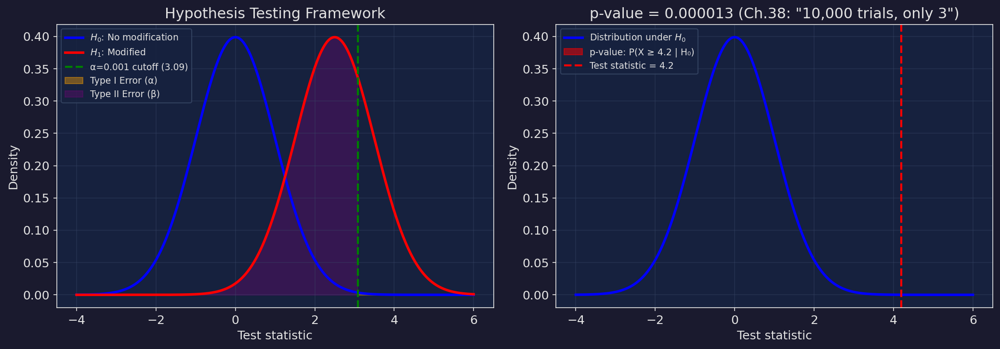
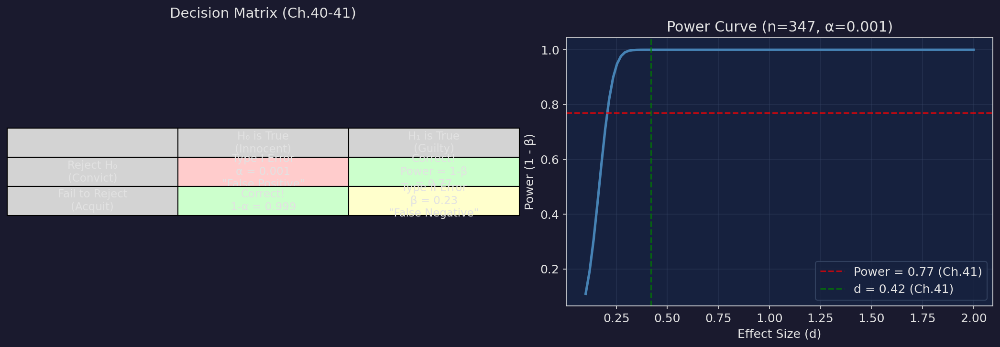
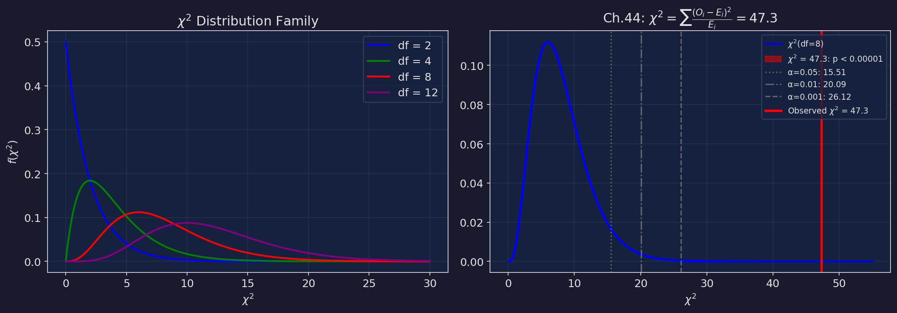

# 機率教室 第四篇：檢定 — 假設檢定、p-value、卡方

> 對應小說第 37-48 章。這一篇是統計推論的核心：怎麼用數據做決策？你可能冤枉了誰？你可能放過了什麼？

---

## 1. 假設檢定的架構

**小說出處**：第37章（起訴書）、第38章（顯著水準）

### 基本設定

$$H_0: \text{虛無假設 (Null Hypothesis)} — \text{「沒事」}$$
$$H_1: \text{對立假設 (Alternative Hypothesis)} — \text{「有事」}$$

### 小說的法庭比喻

```
H₀ = 被告無罪（無罪推定原則）
H₁ = 被告有罪

法官的任務：看證據，決定要不要拒絕 H₀。

重點：
  法官不是在證明 H₁ 是對的。
  法官是在判斷——證據有沒有強到足以推翻 H₀。

  推翻不了 → 「無法拒絕 H₀」（注意：不是「接受 H₀」）
  推翻了 → 「拒絕 H₀」→ 判定 H₁
```

### 假設檢定的五步驟

```
1. 設定 H₀ 和 H₁
2. 選擇顯著水準 α（你願意承受多少「冤枉好人」的風險）
3. 收集數據，算出檢定統計量
4. 算 p-value
5. 如果 p-value < α → 拒絕 H₀
```

---

## 2. 顯著水準 α 與 p-value

**小說出處**：第38章（顯著水準）

### α 是什麼？

$$\alpha = P(\text{拒絕 } H_0 \mid H_0 \text{ 為真}) = P(\text{冤枉好人})$$

常用的 α：

| α | 意義 | 小說用法 |
|---|------|----------|
| 0.05 | 百分之五 | 一般標準 |
| 0.01 | 百分之一 | 較嚴格 |
| 0.001 | 千分之一 | 第38章法庭標準 |

### p-value 是什麼？

$$p\text{-value} = P(\text{觀察到至少這麼極端的數據} \mid H_0 \text{為真})$$

**不是**「H₀ 為真的機率」！這是最常見的誤解。

第38章的翻譯：

```
頻率翻譯：
  p-value = 0.001
  意思是：如果 H₀ 是對的（被告真的沒改先驗），
  你有千分之一的機率看到這麼極端的數據。

  不是「被告有 99.9% 的機率有罪」。

  而是：「如果他無辜，這些數據也太不像話了。」
```

### 第44章費雪的名言留言

> "The p-value is not the probability that H₀ is true. Never was. Never will be."

> 「p-value 等於零點零零零零一。在一萬次裡只有三次。法官——這不是巧合。這是設計。」——第三十八章，貝葉在法庭上



---

## 3. Type I 與 Type II Error

**小說出處**：第40章（百分之五的冤枉）、第41章（百分之二十三的沉默）

### 決策矩陣

|  | H₀ 為真 | H₁ 為真 |
|--|---------|---------|
| **拒絕 H₀** | Type I Error (α) 冤枉好人 | 正確！(Power = 1-β) |
| **不拒絕 H₀** | 正確！(1-α) | Type II Error (β) 放過壞人 |

### Type I Error（第40章）

```
α = 0.001

意思是：每 1000 個無辜的人，有 1 個被冤枉。
台灣有 2300 萬透鏡使用者。
如果每個人都做一次檢定——
有 23,000 個無辜的人會被冤枉。

「千分之一聽起來很小。但乘以兩千三百萬——就是兩萬三千個冤案。」
```

### Type II Error（第41章）

```
β = 0.23

意思是：如果 H₁ 是真的（先驗真的被改了），
有 23% 的機率你檢測不到。

Power = 1 - β = 0.77

這是用以下參數算的：
  n = 347（觀測天數）
  d = 0.42（效應量——偏移有多大）
  α = 0.001（顯著水準）

「百分之二十三的沉默。
有 23% 的真相，你永遠聽不到。
不是因為它不存在。
是因為你的儀器不夠靈敏。」

馬可瑜的煙霧偵測器比喻：
  一年四次火災。偵測器只響了三次。
  不是因為第四次沒有火。
  是因為偵測器有 25% 的漏報率。

  你願意接受嗎？
```

### 如何降低 β？

1. **增加 n（樣本量）**：n 從 347 → 6083（第43章保險數據）
2. **提高 α**：但會增加 Type I Error
3. **效應量 d 更大**：我們控制不了

```
n = 347:  Power = 0.77（第41章）
n = 6083: Power ≈ 0.999+（第43章）

保險數據的加入，讓 Power 從 0.77 飆升到幾乎 100%。
馬可瑜的 6,083 筆保險紀錄改變了一切。
```

> 「百分之二十三的沉默。不是因為真相不存在。是因為你的儀器不夠靈敏。」——第四十一章，馬可瑜的煙霧偵測器



---

## 4. 信賴區間

**小說出處**：第42章（正在消失的數字）、第43章（保險箱）

### 公式（常態近似）

$$\bar{X} \pm z_{\alpha/2} \cdot \frac{\sigma}{\sqrt{n}}$$

95% CI：$z_{0.025} = 1.96$

### 信賴區間寬度 ∝ 1/√n

```
n = 347:   CI 半寬 ≈ 1.96/√347  ≈ 0.1052
n = 329:   CI 半寬 ≈ 1.96/√329  ≈ 0.1080（增加 2.6%）
n = 6083:  CI 半寬 ≈ 1.96/√6083 ≈ 0.0251

第42章：18 筆數據消失（347 → 329）
  CI 變寬了 2.6%。微小但有意義。
  有人在銷毀證據。

第43章：馬可瑜帶來 6,083 筆保險數據
  CI 從 ±0.1052 縮小到 ±0.0251
  精確度提升了四倍。

  信賴區間夠窄 → 估計夠精確 → 證據夠強。
```

### 信賴區間的正確解讀

「95% 信賴區間」的意思是：

> 如果我重複抽樣 100 次，大約 95 次算出來的區間會包含真實值。

**不是**「真實值有 95% 的機率在這個區間內」！

> 「十八筆數據消失了。347 變成 329。信賴區間變寬了百分之二點六。有人在銷毀證據——但他不知道，缺失本身就是證據。」——第四十二章


---

## 5. 卡方檢定 (χ²)

**小說出處**：第44章（卡方）

### 卡方適合度檢定 (Goodness-of-Fit)

$$\chi^2 = \sum_{i=1}^{k} \frac{(O_i - E_i)^2}{E_i}$$

- $O_i$：觀測次數
- $E_i$：期望次數（在 H₀ 下）
- 自由度 $df = k - 1$

### 小說中的骰子比喻

```
「想像一顆骰子。六面。公平的話每面機率 1/6。」

你擲了 600 次。公平骰子預期每面 100 次。

觀測結果：
  1: 95   (O-E = -5)
  2: 102  (O-E = +2)
  3: 98   (O-E = -2)
  4: 105  (O-E = +5)
  5: 97   (O-E = -3)
  6: 103  (O-E = +3)

χ² = 25/100 + 4/100 + 4/100 + 25/100 + 9/100 + 9/100
   = 76/100 = 0.76

df = 5, 臨界值 (α=0.05) = 11.07

0.76 < 11.07 → 不拒絕 H₀ → 骰子是公平的。
```

### 第44章的實際檢定

```
數據：9 個類別的先驗偏移分布

χ² = 47.3
df = 8

臨界值表：
  α = 0.05:  15.51
  α = 0.01:  20.09
  α = 0.001: 26.12

47.3 > 26.12（遠遠超過）
p < 0.00001 → 十萬分之一以下

「47.3。不是不公平。是骰子裡面灌了鉛。」
```

### 獨立性檢定

第44章也提到獨立性 χ² 檢定：

$$\chi^2 = \sum_{i,j} \frac{(O_{ij} - E_{ij})^2}{E_{ij}}$$

其中 $E_{ij} = \frac{R_i \times C_j}{n}$

```
獨立性 χ² = 11.7, df = 6, p = 0.069

p = 0.069 > 0.05 → 不拒絕獨立性
→ 修改模式和區域之間可能是獨立的

但 0.069 很接近 0.05——是「邊緣顯著」。
在統計界，這是最尷尬的位置。
不拒絕，但也不敢說完全沒關係。
```

> 「47.3。不是不公平。是骰子裡面灌了鉛。」——第四十四章，貝葉宣布卡方檢定結果



---

## 6. 小說中的 p-value 完整列表

| 章節 | 檢定 | 統計量 | p-value | 決定 |
|------|------|--------|---------|------|
| Ch.9 | 似然比 (大安) | LR=4.72 | <0.001 | 拒絕 H₀ |
| Ch.9 | 似然比 (中山) | LR=0.04 | 0.84 | 不拒絕 |
| Ch.33 | 蜜罐觸發 | 5.23σ | <0.00001 | 觸發！ |
| Ch.42 | 樣本完整性 | — | 0.00017 | 數據被刪 |
| Ch.44 | 適合度 | χ²=47.3 | <0.00001 | 拒絕 H₀ |
| Ch.44 | 獨立性 | χ²=11.7 | 0.069 | 不拒絕 |

---

## 練習題

**題目 1**：你觀察到以下數據，檢定是否符合 Poisson(λ=2) 分布。

| 事件數 k | 0 | 1 | 2 | 3 | ≥4 | 總計 |
|----------|---|---|---|---|-----|------|
| 觀測 O | 15 | 22 | 28 | 20 | 15 | 100 |
| 期望 E | ? | ? | ? | ? | ? | 100 |

<details>
<summary>解答</summary>

```
先算期望次數（Poisson(λ=2), n=100）：

P(0) = e⁻² = 0.1353 → E₀ = 13.53
P(1) = 2e⁻² = 0.2707 → E₁ = 27.07
P(2) = 2e⁻² = 0.2707 → E₂ = 27.07
P(3) = 4e⁻²/3 = 0.1804 → E₃ = 18.04
P(≥4) = 1 - 上面全部 = 0.1429 → E₄ = 14.29

χ² = (15-13.53)²/13.53 + (22-27.07)²/27.07
   + (28-27.07)²/27.07 + (20-18.04)²/18.04
   + (15-14.29)²/14.29

   = 0.160 + 0.950 + 0.032 + 0.213 + 0.035
   = 1.390

df = 5 - 1 = 4（5 個類別，無估計參數）
臨界值 (α=0.05, df=4) = 9.488

1.390 < 9.488 → 不拒絕 H₀

結論：數據與 Poisson(λ=2) 一致。
```
</details>

**題目 2**：計算以下假設檢定的 Power。H₀: μ=0, H₁: μ≠0, α=0.05, n=50, 真實 μ=0.5, σ=1。

<details>
<summary>解答</summary>

```
標準誤：SE = σ/√n = 1/√50 = 0.1414
臨界值：z₀.₀₂₅ = 1.96

拒絕域：X̄ > 1.96 × 0.1414 = 0.277 或 X̄ < -0.277

在 H₁ (μ=0.5) 下：
  P(X̄ > 0.277) = P(Z > (0.277-0.5)/0.1414)
                = P(Z > -1.578)
                = 0.943

  P(X̄ < -0.277) = P(Z < (-0.277-0.5)/0.1414)
                 = P(Z < -5.50)
                 ≈ 0

Power ≈ 0.943

β = 1 - 0.943 = 0.057 ≈ 5.7%

這個檢定的 Power 很高（94.3%），
因為效應量 d = 0.5/1 = 0.5 算是中等，
而且 n=50 提供了足夠的統計力。
```
</details>
