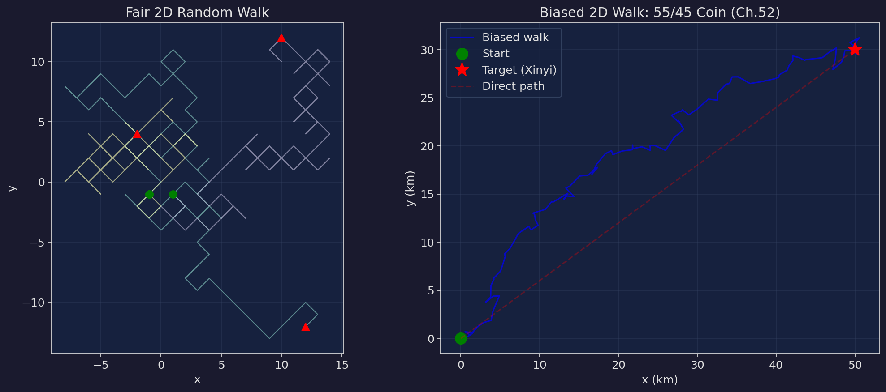
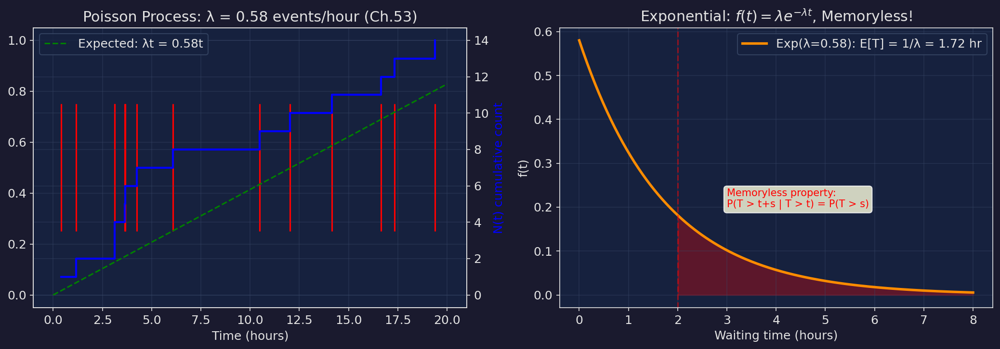

# 機率教室 第五篇：隨機 — 馬可夫鏈、隨機漫步、Poisson 過程

> 對應小說第 49-60 章。最後一篇。這裡的數學是整本書最進階的——但也是最美的。馬可夫鏈讓你看到系統如何收斂，隨機漫步讓你看到自由如何行走，Poisson 過程讓你看到意外如何降臨。

---

## 1. 馬可夫鏈

**小說出處**：第49章（第二階段）、第50章（七十二小時）

### 定義

馬可夫鏈是一個隨機過程，滿足**馬可夫性質**（無記憶性）：

$$P(X_{n+1} = j \mid X_n = i, X_{n-1}, ..., X_0) = P(X_{n+1} = j \mid X_n = i) = p_{ij}$$

> 下一步只取決於現在，不取決於過去。

### 轉移矩陣

$$P = \begin{pmatrix} p_{11} & p_{12} & \cdots & p_{1m} \\ p_{21} & p_{22} & \cdots & p_{2m} \\ \vdots & & \ddots & \vdots \\ p_{m1} & p_{m2} & \cdots & p_{mm} \end{pmatrix}$$

每一行加起來 = 1（從任何狀態出發，必須到某個地方去）。

### 小說中的設定

```
Oracle Prime 的馬可夫鏈：
  - 152 個狀態（台灣 152 個行政區域）
  - 每個區域的先驗構成一個狀態
  - 轉移矩陣 P 定義了先驗如何從一步更新到下一步
  - 每一步 = 6 小時
  - 柏朗的目標：讓所有區域收斂到他設定的穩態 π
```

### 穩態分布

如果存在 π 使得：

$$\boldsymbol{\pi} = \boldsymbol{\pi} P$$

那 π 就是穩態分布（stationary distribution）。

**計算方法**：π 是 P 的轉置矩陣的特徵值 1 對應的特徵向量。

### 數值範例

```
簡化的 3 × 3 轉移矩陣：

P = | 0.7  0.2  0.1 |
    | 0.15 0.7  0.15|
    | 0.1  0.2  0.7 |

求穩態：解 π = πP

  π₁ = 0.7π₁ + 0.15π₂ + 0.1π₃
  π₂ = 0.2π₁ + 0.7π₂ + 0.2π₃
  π₃ = 0.1π₁ + 0.15π₂ + 0.7π₃
  π₁ + π₂ + π₃ = 1

從第一式：0.3π₁ = 0.15π₂ + 0.1π₃
從第三式：0.3π₃ = 0.1π₁ + 0.15π₂

解聯立：π₁ ≈ 0.326, π₂ ≈ 0.370, π₃ ≈ 0.304

不管你從哪個狀態開始，最終都會收斂到這個分布。
這就是柏朗想達到的——所有人的先驗都被「校準」到他設定的 π。
```

> 「不管你從哪個狀態開始。走夠多步。最終都會到同一個地方。這就是柏朗想要的——所有人的先驗，最終收斂到他設定的那個世界。」——第四十九章


---

## 2. 收斂速率與 |λ₂|

**小說出處**：第50章（七十二小時）、第52章（收斂）

### 收斂定理

如果馬可夫鏈是**不可約**（irreducible）且**非周期**（aperiodic）的：

$$\| \boldsymbol{\pi}_n - \boldsymbol{\pi} \| \sim C \cdot |\lambda_2|^n$$

- $|\lambda_2|$：轉移矩陣的第二大特徵值的絕對值
- n：步數
- $|\lambda_2|$ 越小，收斂越快

### 小說中的倒計時

```
柏朗不斷調整轉移矩陣，加速收斂：

  初始：|λ₂| = 0.847
    → 達到不可逆閾值 (0.01) 需要 log(0.01)/log(0.847) ≈ 27.8 步
    → 27.8 步 × 6 小時/步 ≈ 167 小時 ≈ 7 天

  第一次調整：|λ₂| = 0.793
    → log(0.01)/log(0.793) ≈ 19.8 步 ≈ 119 小時 ≈ 5 天

  第二次調整：|λ₂| = 0.761
    → log(0.01)/log(0.761) ≈ 16.9 步 ≈ 101 小時 ≈ 4.2 天

  柏朗在壓縮時間。每次調整 |λ₂|，他都在加快世界走向「穩態」的速度。

收斂到第九步（Ch.56）：
  ‖π_n - π‖ = 0.019
  不可逆閾值 = 0.010
  差距 = 0.009

  再一步就不可逆了。
  蘇立恆在這一步之前凍結了馬可夫引擎。
```

### 數值計算

```
要多少步 n 才能讓 |λ₂|ⁿ < ε？

n > log(ε) / log(|λ₂|)

|λ₂| = 0.847, ε = 0.001（完全穩態）：
  n > log(0.001) / log(0.847) = -6.908 / -0.166 = 41.6 步

|λ₂| = 0.761, ε = 0.001：
  n > log(0.001) / log(0.761) = -6.908 / -0.273 = 25.3 步

省了 16 步 → 省了 96 小時 → 四天。
```

---

## 3. 遍歷性定理

**小說出處**：第50章

### 定理

如果馬可夫鏈是不可約、非周期、正常返的：

$$\frac{1}{n} \sum_{k=0}^{n-1} \mathbf{1}(X_k = i) \xrightarrow{n \to \infty} \pi_i$$

> 在狀態 i 花費的時間比例，長期來看等於穩態機率 π_i。

### 直覺

想像你在一座城市裡隨機走路。雖然你的路線是隨機的，但長期來看，你在每個區域花的時間比例是固定的——等於穩態分布。

你不需要知道穩態是什麼。走夠久了，你自然會花「正確」的時間在每個地方。

### 小說的意義

```
柏朗想利用遍歷定理：
  只要讓馬可夫鏈跑夠多步，
  每個區域的先驗就會自然收斂到他設定的值。
  不需要直接修改。只需要設好轉移矩陣。讓時間做剩下的事。

遍歷性 = 不可逆。一旦收斂，就永遠是那個狀態。
除非你凍結馬可夫引擎——在它收斂之前。
```

> 「遍歷性。一旦收斂，就永遠是那個狀態。除非你在它收斂之前——凍結一切。」——第五十章，馬可瑜的計算


---

## 4. 隨機漫步 (Random Walk)

**小說出處**：第51章（擲硬幣）、第52章（收斂）

### 一維隨機漫步

每一步：

$$X_n = X_{n-1} + Z_n, \quad Z_n = \begin{cases} +1 & \text{with prob } p \\ -1 & \text{with prob } 1-p \end{cases}$$

位置 = 所有步驟的總和：$S_n = \sum_{i=1}^{n} Z_i$

### 公平漫步 (p = 0.5)

- $E[S_n] = 0$（平均不動）
- $\text{Var}(S_n) = n$
- $\sigma(S_n) = \sqrt{n}$（偏離零點的期望距離以 √n 增長）

**回歸定理**：一維公平漫步以機率 1 回到原點。
但二維公平漫步也以機率 1 回到原點。
三維以上的公平漫步——不一定回得來。

### 偏幣漫步 (p = 0.55)——小說的設定

```
蘇立恆的硬幣：P(正面) = 0.55, P(反面) = 0.45

漂移 = E[Zn] = 0.55 × (+1) + 0.45 × (-1) = 0.10

每一步平均往目標方向移動 0.10

在 n 步後：
  E[Sn] = 0.10n（線性漂移）
  Var(Sn) = n × 0.55 × 0.45 × 4 = 0.99n
  σ(Sn) = 0.995√n

第52章數據：
  47 步走完
  左轉（朝目標）：28 次 (59.6%)
  右轉：19 次 (40.4%)

  期望：55% 左轉 = 25.85 次
  觀測：28 次 → 比期望多

  直線距離：7.3 公里
  實際路程：14.2 公里
  效率：7.3 / 14.2 = 51.4%

  效率 51.4% 意味著一半的路程被「隨機」消耗了。
  但正是這個消耗讓他們不可預測。
```

### 偏幣漫步 vs 馬可夫預測

```
為什麼偏幣能打敗馬可夫鏈的預測？

馬可夫鏈的預測依賴轉移矩陣——
它假設你的下一步只取決於當前狀態。

但如果你每一步的方向由硬幣決定——
轉移矩陣無法預測硬幣的結果。

每一步都有 45% 的機率「錯誤方向」。
這個 45% 的噪音就是你的護甲。
馬可夫鏈可以預測你的平均趨勢——但無法預測單步。

「轉移矩陣能算出你大概往哪走。但它不知道你下一步往哪走。」
```

> 「你連擲硬幣都這麼嚴謹。」「實驗設計的基本功。隨機分配。雙盲。不讓偏好進來。」——第五十一章，貝葉與蘇立恆在路口

> 「效率百分之五十一。意味著一半的路程被隨機消耗了。但正是這一半的消耗讓他們不可預測。」——第五十二章




---

## 5. Poisson 過程

**小說出處**：第53章（Poisson 的意外）

### 定義

Poisson 過程 {N(t), t ≥ 0} 是一個計數過程，滿足：

1. N(0) = 0
2. 增量獨立
3. 在 [t, t+s) 內發生的事件數 ~ Poisson(λs)

$$P(N(t+s) - N(t) = k) = \frac{(\lambda s)^k e^{-\lambda s}}{k!}$$

### 等待時間——指數分布

第一個事件的等待時間 T ~ Exponential(λ)：

$$P(T > t) = e^{-\lambda t}$$

$$E[T] = \frac{1}{\lambda}$$

### 無記憶性

$$P(T > t + s \mid T > t) = P(T > s)$$

> 你已經等了多久完全不影響接下來還要等多久。

### 小說中的數值（第53章）

```
λ = 0.58 事件/小時

P(0 events in 1 hour) = e^(-0.58) = 0.560

  → 56% 的機率下一個小時什麼都不會發生

P(≥1 event in 1 hour) = 1 - 0.560 = 0.440

  → 44% 的機率至少有一件意外

期望等待時間 = 1/0.58 ≈ 1.72 小時

過去 12 小時的數據：
  7 次 Poisson 事件
  正向 3 次，負向 4 次
  平均間隔 12/7 ≈ 1.71 小時（非常接近理論值 1.72）

「Poisson 事件不可預測。但它的頻率可以計算。
你不知道下一個意外什麼時候來。
但你知道——平均每 1.72 小時一個。
這就是隨機的秩序。」
```

### Poisson 過程的美妙性質

1. **合併**：兩個獨立的 Poisson(λ₁) 和 Poisson(λ₂) 合併 → Poisson(λ₁ + λ₂)
2. **分裂**：每個事件獨立分類為 A (機率 p) 或 B (機率 1-p) → A 是 Poisson(λp)，B 是 Poisson(λ(1-p))
3. **均勻分佈**：給定 N(t) = n，n 個事件的發生時間在 [0, t] 上均勻分佈

> 「你不知道下一個意外什麼時候來。但你知道——平均每 1.72 小時一個。這就是隨機的秩序。不確定性是代價。但不確定性也是武器。」——第五十三章



---

## 6. Graceful Shutdown vs. 強制關閉

**小說出處**：第54章（消防梯）、第56章（S.L.H.）

這不是純數學概念，但背後的邏輯是：

```
馬可夫鏈收斂中（第九步，共十二步）：
  ‖π_n - π‖ = 0.019
  不可逆閾值 = 0.010

兩種選擇：

方案A：Graceful Shutdown（優雅關閉）
  - 讓馬可夫引擎完成當前步驟
  - 停止轉移矩陣
  - 所有區域的先驗凍結在當前值
  - 然後逐步回退到修改前的值
  - 需要管理員權限（卡片）

方案B：Emergency Freeze（緊急凍結）
  - 直接斷電
  - 馬可夫鏈在轉移過程中被中斷
  - 部分區域在舊值，部分在新值
  - 先驗不一致 → 系統崩潰

蘇立恆選了方案A——但需要柏朗的卡片。
這就是天台對話的數學背景。
```

---

## 7. v5.0 的選擇分布 — 自由的數學

**小說出處**：第57章（選擇）

### 結果

| 選項 | 比例 | 數學含義 |
|------|------|----------|
| 官方先驗 | 33.1% | 繼續使用 Oracular 的貝氏更新 |
| 個人先驗 | 29.4% | 使用自己的先驗模型 |
| 無先驗模式 | 16.8% | 只看似然，不加先驗 |
| 關閉透鏡 | 9.2% | 完全不使用系統 |
| 尚未決定 | 11.5% | 還在思考 |

### 為什麼「沒有超過 50%」很重要？

```
馬可瑜的分析：

「沒有任何一個選項超過百分之五十。」

如果有一個選項 > 80%：
  → 可能有外力在推（宣傳、恐懼、從眾效應）
  → 選擇不是自由的

但 33% / 29% / 17% / 9% / 12%：
  → 每個選項都有人選
  → 選擇是分散的
  → 這就是自由分布的樣子

人類本來就不一樣。
先驗本來就每個人不同。
一個真正自由的選擇——看起來就是這樣。
分散的。不整齊的。充滿方差的。
```

> 「沒有任何一個選項超過百分之五十。這就是自由分布的樣子。人類本來就不一樣。先驗本來就每個人不同。這是對的。」——第五十七章，馬可瑜看著三個螢幕


---

## 練習題

**題目 1**：給定轉移矩陣 P = [[0.8, 0.2], [0.4, 0.6]]，求穩態分布 π。

<details>
<summary>解答</summary>

```
π = πP
π₁ = 0.8π₁ + 0.4π₂
π₂ = 0.2π₁ + 0.6π₂
π₁ + π₂ = 1

從第一式：0.2π₁ = 0.4π₂ → π₁ = 2π₂
代入 π₁ + π₂ = 1：2π₂ + π₂ = 1 → π₂ = 1/3

π = (2/3, 1/3)

驗證：π P = (2/3, 1/3) × [[0.8, 0.2], [0.4, 0.6]]
     = (2/3 × 0.8 + 1/3 × 0.4, 2/3 × 0.2 + 1/3 × 0.6)
     = (0.533 + 0.133, 0.133 + 0.200)
     = (0.667, 0.333)
     = (2/3, 1/3) ✓
```
</details>

**題目 2**：|λ₂| = 0.85。要讓 ‖π_n - π‖ < 0.001，至少需要多少步？

<details>
<summary>解答</summary>

```
|λ₂|ⁿ < 0.001
0.85ⁿ < 0.001
n × log(0.85) < log(0.001)
n > log(0.001) / log(0.85)
n > -6.908 / -0.163
n > 42.4

至少需要 43 步。

如果每步 6 小時：43 × 6 = 258 小時 ≈ 10.75 天

如果柏朗把 |λ₂| 壓到 0.76：
  n > -6.908 / -0.274 = 25.2 → 26 步
  26 × 6 = 156 小時 ≈ 6.5 天

省了 4.25 天。這就是「加速收斂」的實際效果。
```
</details>

**題目 3**：顧客到達商店服從 Poisson(λ=3/hr)。求：(a) 一小時內剛好 5 位顧客的機率 (b) 等待下一位顧客超過 30 分鐘的機率

<details>
<summary>解答</summary>

```
(a) P(N(1) = 5) = e^(-3) × 3⁵ / 5!
   = 0.0498 × 243 / 120
   = 12.102 / 120
   = 0.1008 ≈ 10.1%

(b) 等待時間 T ~ Exp(λ=3)
   30 分鐘 = 0.5 小時

   P(T > 0.5) = e^(-3 × 0.5)
              = e^(-1.5)
              = 0.2231 ≈ 22.3%

   無記憶性驗證：
   假設你已經等了 10 分鐘還沒人來。
   P(再等 20 分鐘以上 | 已等 10 分鐘)
   = P(T > 30min | T > 10min)
   = P(T > 20min)  ← 無記憶性！
   = e^(-3 × 1/3)
   = e^(-1) = 0.368

   過去等的 10 分鐘完全不影響未來。
   這就是指數分布的無記憶性。
```
</details>

---

## 全書公式速查表

| 名稱 | 公式 | 出處 |
|------|------|------|
| 貝氏定理 | P(θ\|D) ∝ P(θ) × P(D\|θ) | Ch.11 |
| Beta 期望值 | E[θ] = α/(α+β) | Ch.1 |
| Beta 共軛更新 | Beta(α+k, β+n-k) | Ch.16 |
| Poisson PMF | P(X=k) = e^(-λ)λᵏ/k! | Ch.4, 53 |
| 指數 CDF | P(T≤t) = 1-e^(-λt) | Ch.53 |
| 期望值線性性 | E[aX+b] = aE[X]+b | Ch.25 |
| 變異數 | Var(X) = E[X²]-(E[X])² | Ch.27 |
| Chebyshev | P(\|X-μ\|≥kσ) ≤ 1/k² | Ch.29 |
| MGF | M(t) = E[e^(tX)] | Ch.34 |
| χ² 檢定 | χ² = Σ(O-E)²/E | Ch.44 |
| 穩態分布 | π = πP | Ch.49 |
| 收斂速率 | ‖π_n-π‖ ~ \|λ₂\|ⁿ | Ch.50 |
| Random Walk 漂移 | E[Sn] = n(2p-1) | Ch.51 |
| Poisson 過程 | N(t) ~ Poisson(λt) | Ch.53 |
